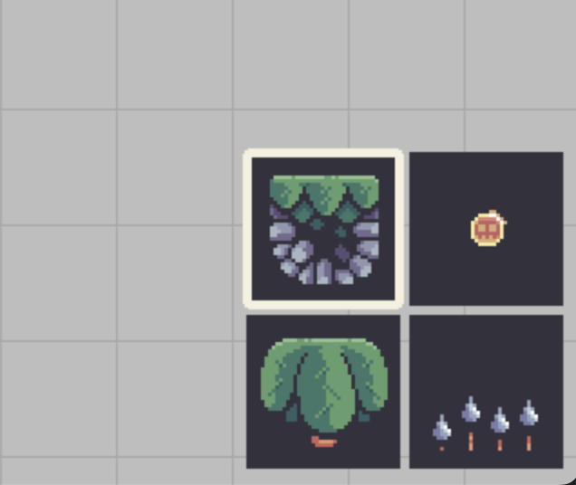
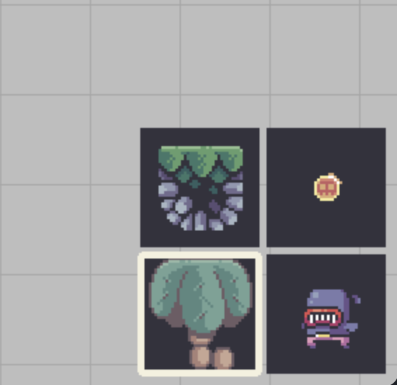

# Treasure-Hunters-Pygame

## Diary
### 1 July - initial setup 
Add settings.py to store different variables. Create origin point and draw support lines. Change mouse cursor effect.  

### 2 July - create menu 
Create a seperate menu.py file. Menu area located in the right buttom of the screen with 4 buttons (tile, coin, enemy and palm). Each button has different buton surfaces which can be toggled and switched. Add highlight function if one button has been selected. By pressing right mouse button to switch different button surfaces. For palm buttons, there are 2 group images (front and back) which can be selected by pressing middle mouse button. Followings are screenshots of menu bar.  
 
  
Create canvas tile and get a dic of canvas data. Complete level drawing using different color tiles. Following screenshot is the display of level drawing (blue tile: water, brown tile: terrain, red tile: enemy, yellow tile: coin).  
  