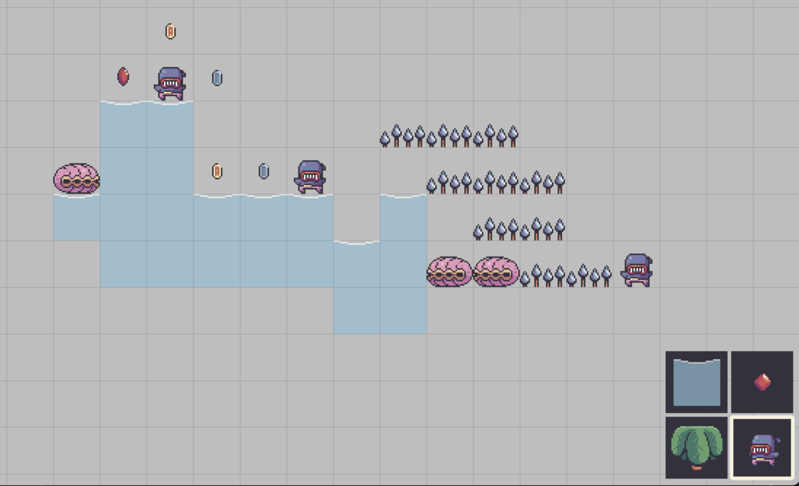
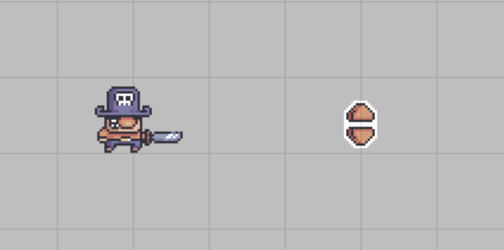
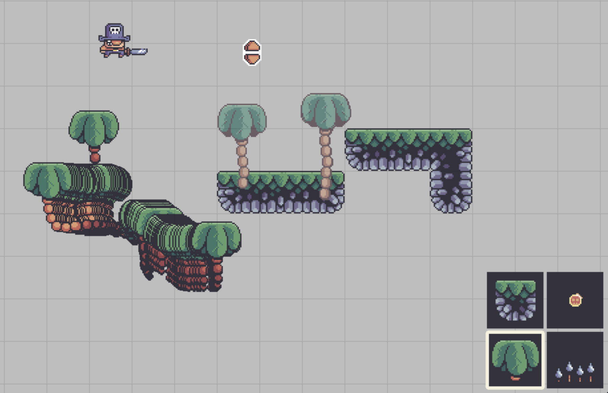
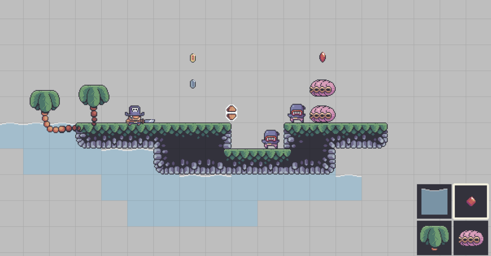
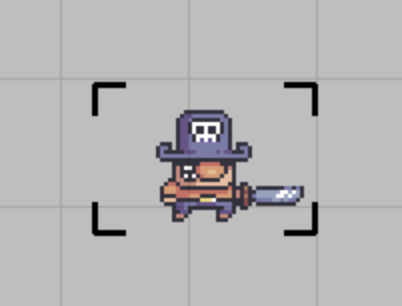
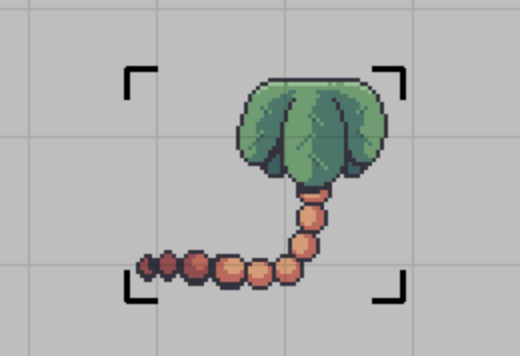
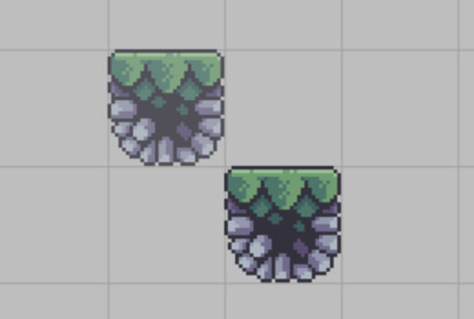

# Treasure-Hunters-Maker

## Diary
### 1 July - initial setup 
Add settings.py to store different variables. Create origin point and draw support lines. Change mouse cursor effect.  

### 2 July - create menu 
Create a seperate menu.py file. Menu area located in the right buttom of the screen with 4 buttons (tile, coin, enemy and palm). Each button has different buton surfaces which can be toggled and switched. Add highlight function if one button has been selected. By pressing right mouse button to switch different button surfaces. For palm buttons, there are 2 group images (front and back) which can be selected by pressing middle mouse button. Followings are screenshots of menu bar.  
 
   
Create canvas tile and a dict to store canvas data. Complete level drawing using different color tiles. Following screenshot is the display of level drawing (blue tile: water, brown tile: terrain, red tile: enemy, yellow tile: coin).  
   
Create a seperate support.py file to store import_folder functions. Get a current cell position and check the neighbors of this cell (creating a local_cluster (3*3)). By cheching every neighbors of a cell to deciede which type of terrian to place. 
 
   

### 3 July - create menu 
Using the same way as terrians to render water tiles. Create an animation_update function to import different animation graphics and render specific animation according to user's choice. Following screenshot shows the different animation graphics  
   

### 4 July  
Accomplish the function to delete tiles by clicking right mouse button. This works for selected goup of tiles and neighbors will be checked after tail has been removed.  
Add a new class named CanvasObject which store the methods of objects(player, sky_handle, palm). By adding object_drag function to achive dragging movement for objects.There is a bug to fix as showing on seconde screenshot, a timer need to add to avoid overlapping palms. 
 
   
Fixed the bug by adding a timer checking. 
   

### 5 July 
Add preview effect for object when hover over and add preview for selected tiles before placing them on the map. 
 
 
   
